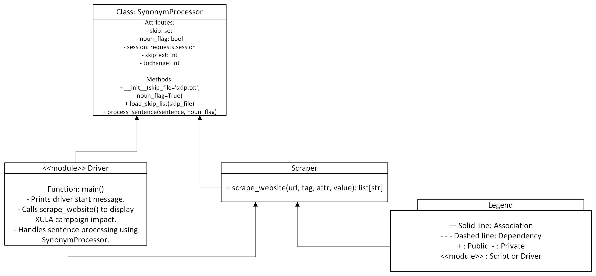

# 🦩 Team Egret — XULA Open Source Improvement Project

**Team Members:**  
- Lead: Samuel Maxey (@smax-byte)  
- Designer: @zodagoatfr  
- Software Engineer (SWE): @justrobin14  
- Tester: @kyleighharkless  

---

## 🧭 Project Overview
Team Egret will be improving and expanding upon selected open-source repositories as part of the XULA Software Engineering Project.  
Our goal is to analyze, enhance, and document six repositories — improving their functionality, readability, and testing coverage while demonstrating collaborative software development practices.

---

---

## 🖼️ Project Assets

### Brand Image  

### Favicon  

### UML Class Diagram  

---

### 🗂️ Selected Repository

1. [ProtectFromPlagiarismChecker](https://github.com/aks060/ProtectFromPlagiarismChecker) — Python script by @aks060. ([GitHub][1])
   

### 🗂️ Other Repositories (Priority Order)

1. [Generic N-ary Tree](https://github.com/c05mic/GenericN-aryTree) — Java implementation by @c05mic. ([GitHub][2])
2. [Sorting Algorithms (OpenSource)](https://github.com/SvenWoltmann/sorting-algorithms-ultimate-guide) — repository by SvenWoltmann. ([GitHub][3])
3. [IMDB Top Scrape](https://github.com/Devanshi1206/IMDb-Top-250-Movies) — Python scraping project. ([GitHub][4])
4. [Sorting Visualiser (Java)](https://github.com/Sarvesh223/Sorting_Visualiser_minor) — Java sorting visualizer project. ([GitHub][5])
5. [Sentiment Analysis of Twitter Data](https://github.com/sharmaroshan/Twitter-Sentiment-Analysis) — Twitter-sentiment project. ([GitHub][6])

## 🧪 Testing Plan
Each team member will contribute to testing based on their roles:

- Tester: Scrape Centennial Campaign Impact from XULA’s website.  
- SWE & Tester: Write 10 unit tests for the scraping function using JUnit 5 or unittest.  
- Designer & Lead: Implement one UML class and create at least 20 unit tests.  
- SWE: Implement a different UML class and create at least 10 unit tests.  

> Testing documentation and results will be added here once tests are implemented.

## 📜 Contributing Guidelines
The Software Engineer will create a `CONTRIBUTING.md` file outlining:  
- Branching and commit message conventions  
- How to run and test code locally  
- Issue creation and resolution process  
- Pull request review and merge procedures  
- Testing requirements before submitting commits  

## 🧾 License
A proper open-source LICENSE file will be created and committed to the repo.  
The team will select an appropriate license (MIT, Apache 2.0, or GPL) once the base repository setup is finalized.  

> All contributions will follow this license to maintain open-source compliance and credit authors appropriately.

## 📋 Issues & Workflow
Each team member will be assigned 5 issues after our kickoff meeting.  
The Lead and SWE will also generate 30 unassigned issues for continued development.

## Timeline
|------|--------|-----------|
| Finalize remaining 4 repos | Team | Monday |
| Complete To-Do #11 | Lead & Designer | Sunday |
| Assign 5 issues to each team member | Lead | Monday |
| Create 30 unassigned issues | Lead & SWE | Monday |
| Ensure all members can access and comment on issues | Team | Monday |
| Conduct team meeting to review and finalize assigned issues | Lead | Monday |
| Create branding assets (Figma + PNG) | Designer | Thursday |
| Upload UML diagram | Lead & Designer | Thursday |
| Implement first UML class | Lead & Designer | Thursday |
| Write 20+ tests | Lead & Designer | Thursday |
| Implement SWE UML class | SWE | Thursday |
| Write 10+ tests | SWE | Thursday |
